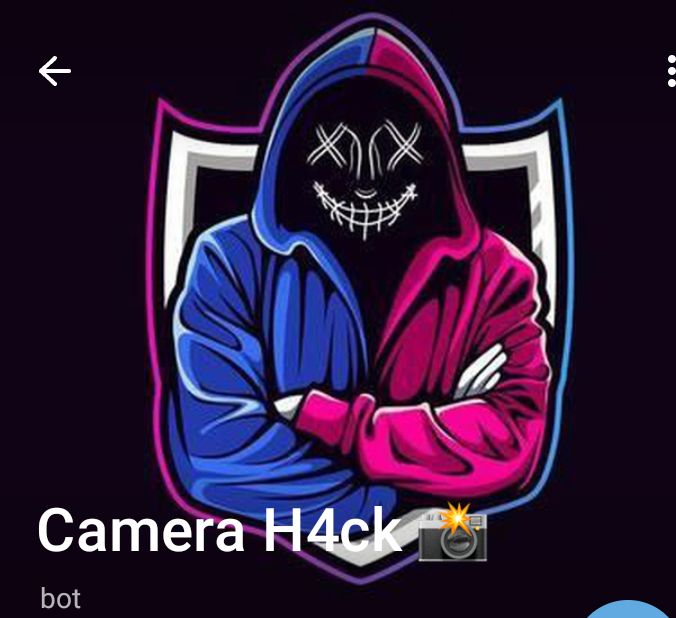

<h2 align='center'>Camera & location Tracker using a link.</h2>

This tool is based upon [click]((https://t.me/+KeBQRQL417BhYmRl)) .This is a telegram implementation with extra features than.

 
#### [Video Tutorial](https://youtu.be/xmhr-MBTccs?si=c0urOE8UK4MYMlmP)

[]

**Make sure you put `bot` as the secret's key , it's case sensitive.**

### How to build
1. Create a telegram bot through [BotFather](https://t.me/BotFather).
1. Copy it's API key
1. Clone the repo using `git clone https://github.com/https://Vishal0Hacker/Camera-location-Tracker`
1. `cd TrackDown`
1. Create a environment variable in `.env` file named `bot` and put your telegram bot token as it's value.
1. Replace your website URL at [@Vishalzxx]((https://t.me/@Vishalzxx))
